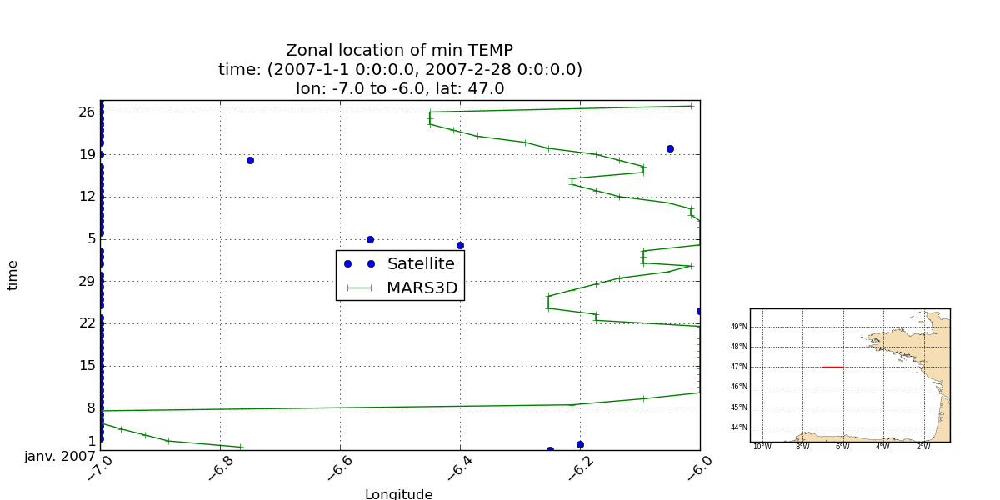
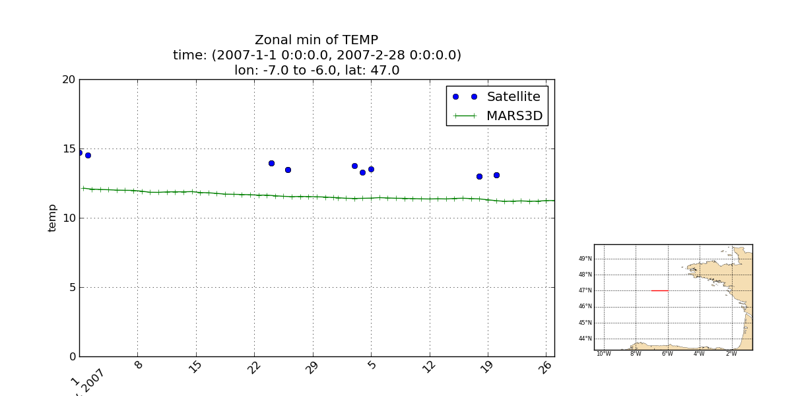

.. _user.scripts.localize:

.. note:: This script is sligthly obsolete and must be updated to be able to work with other model outputs, and renamed.

:program:`localize.py`
======================

Il s'agit du script permettant la visualisation le long d'une section 1D (transversale):
  - de la localisation méridienne du minimum de température à un dégré de latitude donné.
  - du minimum de température à un dégré de latitude donné.

Une mini carte est également affichée permettant de localiser la section.

La section 1D (position) peut être faite sur des données de modèle, de climatologie ou satellite,
plus généralement sur des données 3D (tyx) ou 4D (tzyx) avec selection de niveau.

Si les données sont 4D (+z), alors le niveau requis doit être spécifié en configuration
(normalement la surface), par défaut la première couche sera considérée.

La description des données à représenter est définie par le fichier de configuration.
Les options en ligne de commande (voir usage), sont aussi paramétrables dans le fichier de
configuration.

Le script produit un tracé par intervalle de temps et par variable.

Usage
~~~~~

.. code-block:: none
    
    Usage: localize.py [options]
    
    Options:
      --version             show program's version number and exit
      -h, --help            show this help message and exit
      --cfgfile=CFGFILE     Configuration file
      -v varname[,alias]*, --variables=varname[,alias]*
                            Variables to be processed. Use aliases when varname
                            differ between datasets. This option may be repeated
                            to produce figures for each variable definition.
      -t min,max,[bb],step,unit, --time=min,max,[bb],step,unit
                            Time selection: - min,max: specify the time range to
                            operate. - bb: optionnal, time bounds open/closed
                            selection. - step,unit: period covered by each plot.
                            Ex:  "2001-01,2001-01-15T00,7,days"
                            "2001-06,2001-09,co,1,month"
      -l level, --level=level
                            Level indice for model data (0 based, default: -1)
      -m, --meridional      Specify the section is meridional, at a longitude and
                            along given latgitude range (default is zonal)
      -c xy1,xy2,xy, --coords=xy1,xy2,xy
                            Hovmoller's section coordinates xy1 and xy2 are
                            longitudes and xy a latitude if the section is zonal,
                            latitudes and a longitude if the section is meridonal
      -b lonmin,latmin,lonmax,latmax, --bbox=lonmin,latmin,lonmax,latmax
                            Restrict processed zone to the specified bounding box
      --op=OPERATIONS       Specify one or more operation in ('min', 'max'),
                            default is none
      --plot=PLOTS          Specify one or more figure in ('loc', 'val'), default
                            is none
      -o pattern, --output=pattern
                            Output files pattern  (default:
                            %(plot)s-%(op)s-%(var)s-%(tmin)s-%(tmax)s.png)
      --show                Show figures
    

Aperçu des sorties
~~~~~~~~~~~~~~~~~~

**Localisation du minimum dans le temps:**

**Valeur du minimum dans le temps:**

