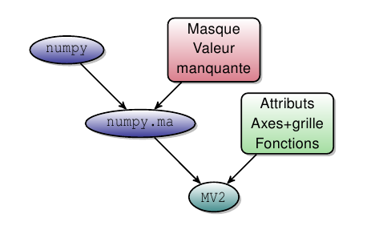

Leçon d'introduction à (UV)CDAT
===============================

Introduction
------------

CDAT est destiné à la communauté océano/météo/climat.

    - CDAT étend les variables masquées de numpy 
      en ajoutant attributs, axes (et grille) et autres méthodes : 
      parallèle avec le netcdf (cf. note ci-dessous).
    - CDAT offre des outils pour lire, écrire et traiter ces variables : 
      ces outils n'ont pas besoin de recevoir les coordonnées
      en argument.

    Le passage de :mod:`numpy` à :mod:`MV2` (CDAT).

.. note:: Parallèle avec le netcdf.

    Côté python :
    
    >>> var.info()
    *** Description of Slab temp ***
    id: temp
    shape: (3,)
    filename:
    missing_value: 1e+20
    comments:
    grid_name: N/A
    grid_type: N/A
    time_statistic:
    long_name: Temperature
    units: degC
    No grid present.
    ** Dimension 1 **
    id: lon
    Designated a longitude axis.
    units:  degree_north
    Length: 3
    First:  0
    Last:   2
    Other axis attributes:
        long_name: Longitude
        axis: X
        modulo: 360.0
        topology: circular
    Python id:  0x39efc10
    *** End of description for temp ***

    Côté fichier netcdf ::
    
        netcdf toto {
        dimensions:
        lon = 3 ;
        bound = 2 ;
        variables:
        int lon(lon) ;
            lon:bounds = "bounds_lon" ;
            lon:units = "degree_north" ;
            lon:long_name = "Longitude" ;
            lon:axis = "X" ;
            lon:modulo = 360. ;
            lon:topology = "circular" ;
        double bounds_lon(lon, bound) ;
        double temp(lon) ;
            temp:units = "degC" ;
            temp:long_name = "Temperature" ;
            temp:name = "variable_3" ;
            temp:missing_value = 1.e+20 ;

        // global attributes:
            :Conventions = "CF-1.0" ;
        }
    

Les bases
----------

Fichier :file:`courses_cdat_bases.py`

.. literalinclude:: ../../../../scripts/courses/courses_cdat_bases.py

Les utilitaires
---------------

Fichier :file:`courses_cdat_tools.py`

.. literalinclude:: ../../../../scripts/courses/courses_cdat_tools.py

