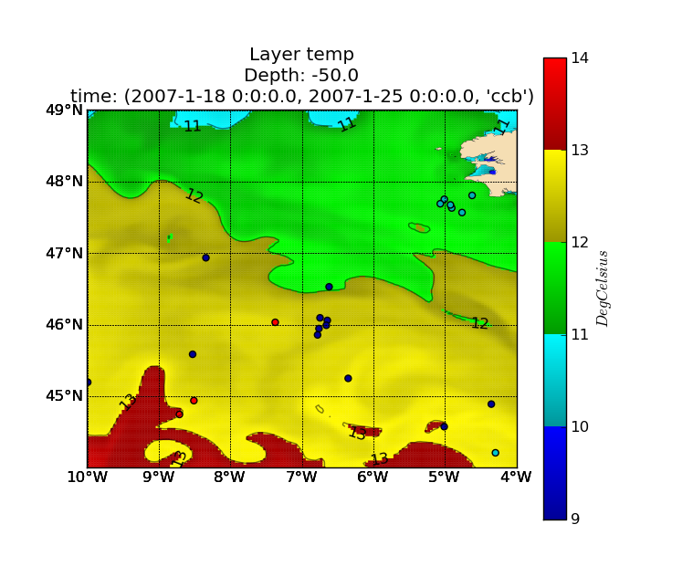
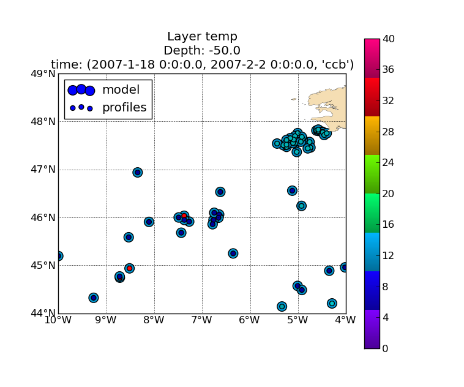

.. _user.scripts.layer:

.. note:: This script is sligthly obsolete and must be updated to be able to work with other model outputs, and renamed.

:program:`layer.py`
===================

Il s'agit du script permettant la visualisation d'un champs de données à une certaine profondeur.

Ce script permet la visualisation conjointe de variables de données
grillées (modèle,climatologie) et d'observation (profils in situ).

La description des données à représenter est définie par le fichier de configuration.
Les options en ligne de commande (voir usage), sont aussi paramétrables dans le fichier de
configuration.

Le script produit un tracé par intervalle de temps et par variable.

Usage
~~~~~

.. code-block:: none

    Usage: layer.py [options]

    Produce horizontal layer plots

    Options:
      --version             show program's version number and exit
      -h, --help            show this help message and exit
      --cfgfile=CFGFILE     Configuration file
      -v varname[,alias]*, --variables=varname[,alias]*
                            Variables to be processed. Use aliases when varname
                            differ between datasets. This option may be repeated
                            to produce figures for each variable definition.
      -t min,max,[bb],step,unit, --time=min,max,[bb],step,unit
                            Time selection: - min,max: specify the time range to
                            operate. - bb: optionnal, time bounds open/closed
                            selection. - step,unit: period covered by each plot.
                            Ex:  "2001-01,2001-01-15T00,7,days"
                            "2001-06,2001-09,co,1,month"
      -d depth, --depth=depth
                            Depth selection (m)
      -b lonmin,latmin,lonmax,latmax, --bbox=lonmin,latmin,lonmax,latmax
                            Restrict processed zone to the specified bounding box
      --coloc=COLOC         Use colocation method, one of ('nearest', 'interp'),
                            default is none)
      -o pattern, --output=pattern
                            Output files pattern (default:
                            layer-%(var)s-%(depth)s-%(tmin)s-%(tmax)s.png)
      --show                Show figures

Aperçu des sorties
~~~~~~~~~~~~~~~~~~

**Tracé d'une couche sans colocalisation:**

**Tracé d'une couche avec colocalisation par plus proche voisin:**

**Tracé d'une couche avec colocalisation par interpolation:**

