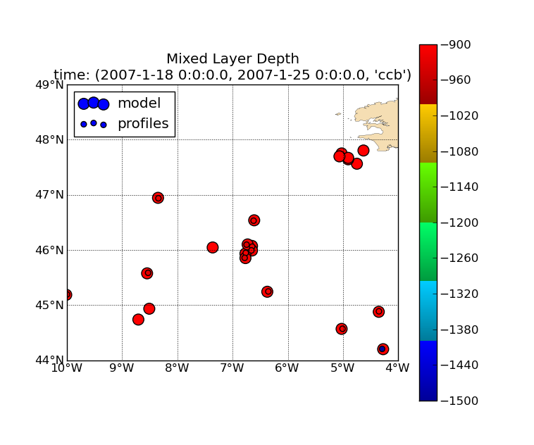
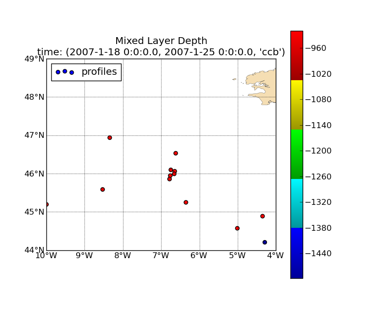

.. _user.scripts.stratif:

:program:`stratif.py`
=====================

Il s'agit du script permettant:
  - la visualisation de la profondeur de la couche de mélange en eaux peu profondes.
  - la visualisation du déficit d'énergie potentielle.

Ce script permet la visualisation conjointe des paramètres de stratification de données
grillées (modèle,climatologie) et d'observation (profils in situ) afin de les comparer.

La description des données à représenter est définie par le fichier de configuration.
Les options en ligne de commande (voir usage), sont aussi paramétrables dans le fichier de
configuration.

Le script produit un tracé par intervalle de temps et par variable.

Usage
~~~~~

.. code-block:: none
    
    Usage: stratif.py [options]
    
    Options:
      --version             show program's version number and exit
      -h, --help            show this help message and exit
      --cfgfile=CFGFILE     Configuration file
      -t min,max,[bb],step,unit, --time=min,max,[bb],step,unit
                            Time selection: - min,max: specify the time range to
                            operate. - bb: optionnal, time bounds open/closed
                            selection. - step,unit: period covered by each plot.
                            Ex:  "2001-01,2001-01-15T00,7,days"
                            "2001-06,2001-09,co,1,month"
      -b lonmin,latmin,lonmax,latmax, --bbox=lonmin,latmin,lonmax,latmax
                            Restrict processed zone to the specified bounding box
      --coloc=COLOC         Use colocation method, one of ('nearest', 'interp'),
                            default is none)
      --deep                Deep water mode
      --plot=PLOTS          Specify one or more figure in ('mld', 'ped'), default
                            is none
      --show                Show figures
      -o pattern, --output=pattern
                            Output files pattern (default:
                            %(plot)s-%(tmin)s-%(tmax)s.png)
      

Aperçu des sorties
~~~~~~~~~~~~~~~~~~

**Tracé de la profondeur de la couche de mélange en eaux peu profondes sans colocalisation:**

.. image:: stratif_mld.png
    :width: 90%

**Tracé de la profondeur de la couche de mélange en eaux peu profondes avec colocalisation par plus proche voisin:**

**Tracé de la profondeur de la couche de mélange en eaux peu profondes avec colocalisation par interpolation:**

.. image:: stratif_mld_interp.png
    :width: 90%

**Tracé de la profondeur de la couche de mélange en eaux profondes avec colocalisation par plus proche voisin:**

**Tracé de la profondeur de la couche de mélange en eaux profondes avec colocalisation par interpolation:**

.. image:: stratif_mld_deep_interp.png
    :width: 90%

**Tracé du déficit d'énergie potentielle sans colocalisation:**

.. image:: stratif_ped.png
    :width: 90%

**Tracé du déficit d'énergie potentielle avec colocalisation par plus proche voisin:**

.. image:: stratif_ped_nearest.png
    :width: 90%

**Tracé du déficit d'énergie potentielle avec colocalisation par interpolation:**

.. image:: stratif_ped_interp.png
    :width: 90%

